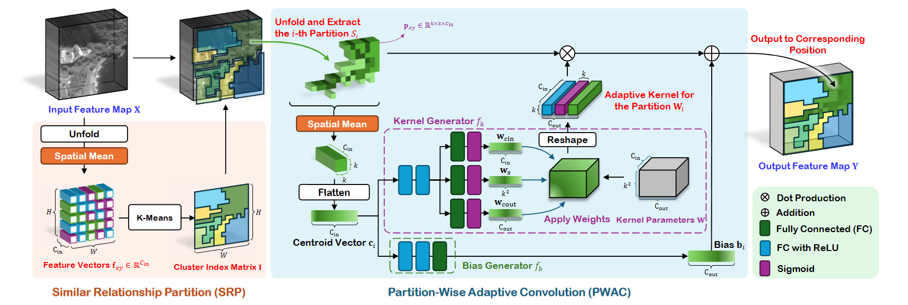

# Content-Adaptive Non-Local Convolution for Remote Sensing Pansharpening

*Yule Duan, Xiao Wu, Haoyu Deng, Liang-Jian Deng*

[](https://openaccess.thecvf.com/content/CVPR2024/html/Duan_Content-Adaptive_Non-Local_Convolution_for_Remote_Sensing_Pansharpening_CVPR_2024_paper.html) [
](https://arxiv.org/abs/2404.07543)



Abstract: Currently, machine learning-based methods for remote sensing pansharpening have progressed rapidly. However, existing pansharpening methods often do not fully exploit differentiating regional information in non-local spaces, thereby limiting the effectiveness of the methods and resulting in redundant learning parameters. In this paper, we introduce a so-called content-adaptive non-local convolution (CANConv), a novel method tailored for remote sensing image pansharpening. Specifically, CANConv employs adaptive convolution, ensuring spatial adaptability, and incorporates non-local self-similarity through the similarity relationship partition (SRP) and the partition-wise adaptive convolution (PWAC) sub-modules. Furthermore, we also propose a corresponding network architecture, called CANNet, which mainly utilizes the multi-scale self-similarity. Extensive experiments demonstrate the superior performance of CANConv, compared with recent promising fusion methods. Besides, we substantiate the method's effectiveness through visualization, ablation experiments, and comparison with existing methods on multiple test sets. The source code is publicly available.

## Getting Started

### Environment Setup with Docker

**Please prepare a Docker environment with CUDA support:**

- Ensure you have Docker installed on your system.
- To enable CUDA support within the Docker environment, refer to the official Docker documentation for setting up GPU acceleration: Docker GPU setup: [https://docs.nvidia.com/datacenter/cloud-native/container-toolkit/latest/install-guide.html](https://docs.nvidia.com/datacenter/cloud-native/container-toolkit/latest/install-guide.html)

If you cannot use Docker, you can also set up the environment manually. However, you may run into issues with the dependencies.

1. **Clone the repo and its submodules:**
    
   ```bash
   git clone --recurse-submodules https://github.com/duanyll/CANConv.git
   ```

2. **Edit mount point for datasets in `.devcontainer/devcontainer.json`:**
    - Locate the `.devcontainer/devcontainer.json` file within the cloned repo.
    - Specify the path to your datasets on your host machine by adjusting the `mounts` configuration in the file.

3. **Reopen the repo in VS Code devcontainer:**
    - Open the cloned repo in VS Code.
    - When prompted, select "Reopen in Container" to activate the devcontainer environment.
    - It may take serval minutes when pulling the base PyTorch image and install requirements for the first time.

4. **Install pacakges and build native libraries**
   - If you are using the devcontainer, you can skip this step, vscode will automatically run the script.
   
   ```bash
   bash ./build.sh
   ```

5. **Train the model:**
    
   ```bash
   python -m canconv.scripts.train cannet wv3
   ```

   - Replace `cannet` with other networks available in the `canconv/models` directory.
   - Replace `wv3` with other datasets defined in `presets.json`.
   - Results are placed in the `runs` folder.

## Additional Information

**Pretrained weights:**
- Pre-trained weights can be found in the `weights` folder.

**Datasets:**
- Datasets are used from the repo [liangjiandeng/PanCollection](https://github.com/liangjiandeng/PanCollection).

**Metrics:**
- Metrics are obtained using tools from [liangjiandeng/DLPan-Toolbox](https://github.com/liangjiandeng/DLPan-Toolbox) (specifically, the `02-Test-toolbox-for-traditional-and-DL(Matlab)` directory).

## Known Issues

- The code is not adapted for using multiple GPUs. If you have multiple GPUs, you can only utilize one GPU for training.
   - If you have to use a device other than `cuda:0`, you have to use `CUDA_VISIBLE_DEVICES` to specify the GPU device.
   - For example, to use the second GPU, you can run `CUDA_VISIBLE_DEVICES=1 python -m canconv.scripts.train cannet wv3`.
   - Notes: Though the Python code respects the `device` option in the configuration file, the C++ code contains direct calls to cuBLAS functions, which may not respect the device option. The `CUDA_VISIBLE_DEVICES` environment variable is the most reliable way to specify the GPU device.

# CANNet 模型修改说明

本文档旨在说明对 `CANNet` 模型 (`canconv/models/cannet/model.py`) 及其配置 (`canconv/models/cannet/config.py`) 所做的主要修改。这些修改的目的是使模型能够根据不同的特征层次采用不同的聚类策略，灵感来源于 `project.mdc` 中的指导方针。

## 主要变更点

核心改动是为了实现网络分层处理，即浅层特征和深层特征采用不同的聚类参数。

1.  **`CANNet` 模型 (`model.py`)**
    *   `CANNet` 类的构造函数 `__init__` 已更新，引入了新的参数来区分浅层和深层模块的配置：
        *   `cluster_num_shallow`: 用于浅层 `CANResBlock` 的聚类数量。
        *   `cluster_num_deep`: 用于深层（bottleneck）`CANResBlock` 的聚类数量。
        *   `cluster_source_shallow`: 用于浅层 `CANResBlock` 的聚类特征来源。根据 `project.mdc` 中"特征展开与池化"的描述，此参数被设置为 `'spatial'`，旨在从特征图的空间维度提取信息进行聚类。
        *   `cluster_source_deep`: 用于深层 `CANResBlock` 的聚类特征来源，保持为 `'channel'`。
    *   模型内部的 `CANResBlock` 实例化已相应更新：
        *   `rb1`, `rb2` (下采样前) 和 `rb4`, `rb5` (上采样后) 被视为浅层模块，使用 `cluster_num_shallow` 和 `cluster_source_shallow`。
        *   `rb3` (位于网络最深处/bottleneck) 被视为深层模块，使用 `cluster_num_deep` 和 `cluster_source_deep`。
    *   这一改动使得模型可以针对不同抽象程度的特征采用更合适的聚类方式，例如在浅层捕捉更细致的空间纹理信息，在深层处理更全局的语义信息。

2.  **`CANNetTrainer` 配置 (`config.py`)**
    *   `CANNetTrainer` 类中的 `_create_model` 方法已修改，以从训练配置文件 (`cfg`) 中读取上述新的模型参数。
    *   使用了 `cfg.get()` 方法为这些新参数提供了默认值，确保即使在配置文件中未显式指定这些新参数时，代码也能向后兼容并运行。
        *   默认 `cluster_num_shallow`: 48
        *   默认 `cluster_num_deep`: 16
        *   默认 `cluster_source_shallow`: "spatial"
        *   默认 `cluster_source_deep`: "channel"
    *   这意味着用户现在可以在其训练配置文件中灵活指定这些参数，以微调不同层级的聚类行为。

## 如何配置

要在训练时使用这些新特性，请在您的训练配置文件（传递给 `CANNetTrainer` 的 `cfg` 字典）中添加或修改以下参数：

```yaml
# 示例配置
model_config:
  # ... 其他模型参数 ...
  spectral_num: 8
  channels: 32
  filter_threshold: 0.005
  # 新增的或可修改的参数
  cluster_num_shallow: 48       # 浅层聚类数
  cluster_num_deep: 16          # 深层聚类数
  cluster_source_shallow: "spatial" # 浅层聚类源 ('spatial', 'channel', or 'pixel')
  cluster_source_deep: "channel"    # 深层聚类源 ('spatial', 'channel', or 'pixel')
  # ... 其他训练参数 ...
```

## 注意事项

*   **`cluster_source` 的选择**: `cluster_source_shallow` 被设置为 `'spatial'` 是基于对 `project.mdc` 中"特征展开与池化"概念的理解，认为其更侧重于空间特征。`CANConv` 层支持的 `cluster_source` 选项包括 `'channel'`, `'spatial'`, 和 `'pixel'`。用户可以根据具体需求和实验结果调整此设置。
*   **显存与性能**: 修改聚类数量（特别是 `cluster_num_shallow`）和 `cluster_source` 可能会影响模型的显存占用和计算效率。建议在目标硬件（如8GB显存显卡）上进行充分测试，并根据实际情况调整这些参数以达到最佳平衡。
*   **保留的显存管理**: 代码中原有的显存释放逻辑 (如 `del` 语句) 均予以保留，以帮助管理显存。

这些修改旨在提高模型的灵活性和表达能力，使其能更好地适应不同层次特征的处理需求。

# 评估脚本 `evaluate_pansharpening.py` 说明

提供了一个 Python 脚本 `evaluate_pansharpening.py` 用于评估预训练的 `CANNet` 全色锐化模型。该脚本可以处理 H5 和 MAT 格式的数据集，并计算多种常用的定量评估指标。

## 使用方法

```bash
python3 evaluate_pansharpening.py \\
    --model_path path/to/your/final.pth \\
    --cannet_bands 8 \\
    --full_res_h5_dir path/to/full_res_h5_data \\
    --full_res_mat_dir path/to/full_res_mat_data \\
    --reduced_res_h5_dir path/to/reduced_res_h5_data \\
    --reduced_res_mat_dir path/to/reduced_res_mat_data \\
    --sensor_range_max 2047.0 \\
    --scale_ratio 4
```

### 参数说明:
*   `--model_path`: 训练好的模型权重文件 (`.pth`) 的路径。
*   `--cannet_bands`: 模型所用的多光谱图像的波段数 (例如，WV3 为 8)。实际在脚本内部会传递给模型的 `spectral_num` 参数。
*   `--full_res_h5_dir`: 包含全分辨率 H5 测试数据的目录。
*   `--full_res_mat_dir`: 包含全分辨率 MAT 测试数据的目录。
*   `--reduced_res_h5_dir`: 包含降分辨率 H5 测试数据的目录。
*   `--reduced_res_mat_dir`: 包含降分辨率 MAT 测试数据的目录。
*   `--sensor_range_max`: 传感器数据的最大可能像素值 (例如 11位数据为 `2^11 - 1 = 2047.0`)。用于归一化。
*   `--scale_ratio`: 全色图像与多光谱图像之间的空间分辨率比例 (例如，PAN 比 MS 分辨率高4倍，则为4)。用于 ERGAS 计算。

## 定量指标计算说明

脚本使用 `sewar` 库和自定义实现来计算以下指标。所有输入图像在计算指标前都会根据 `sensor_range_max` 进行反归一化到原始像素值范围。 对于 `sewar` 库的函数，输入图像通常需要是 `(H, W, C)` 或 `(H, W)` 的 NumPy 数组。

1.  **SAM (Spectral Angle Mapper)**:
    *   通过 `sewar.full_ref.sam(gt, fused)` 计算。
    *   `gt` 是参考图像 (全分辨率下为真实GT，降分辨率下为原始MS上采样后的图像)，`fused` 是融合后的图像。
    *   输入图像被转置为 `(H, W, C)` 格式。值越小表示光谱失真越小。

2.  **ERGAS (Erreur Relative Globale Adimensionnelle de Synthèse)**:
    *   通过 `sewar.full_ref.ergas(gt, fused, r=scale_ratio)` 计算。
    *   `gt` 和 `fused` 同上。
    *   `r` 是空间分辨率比例 (`scale_ratio`)。对于全分辨率评估，`r` 设为1；对于降分辨率评估，`r` 使用用户提供的 `scale_ratio`。
    *   值越小表示融合质量越好。

3.  **Q_avg (Average Quality Index over Bands)**:
    *   基于 `sewar.full_ref.uqi(band_gt, band_fused)` 计算。
    *   脚本内部实现 `Q_avg` 函数，该函数逐波段计算通用图像质量指数 (UQI)，然后取平均值。
    *   `band_gt` 和 `band_fused` 是对应波段的二维图像 `(H, W)`。
    *   值越接近1表示质量越好。默认计算所有波段的平均UQI，相当于Q_N (N为波段数，如Q8)。

4.  **D_λ (Spectral Distortion Index)**:
    *   自定义函数 `D_lambda_metric(fused, ms_orig)` 计算。
    *   首先，原始多光谱图像 `ms_orig` (C, h, w) 通过双三次插值上采样到与融合图像 `fused` (C, H, W) 相同的尺寸。
    *   然后，计算上采样后的 `ms_orig` 和 `fused` 之间的 SAM 值。
    *   此 SAM 值（通常是角度）会除以一个启发式的归一化因子（默认为45.0），以得到 D_λ。这个归一化因子可能需要根据具体场景调整。
    *   值越小表示光谱差异越小。

5.  **D_s (Spatial Distortion Index)**:
    *   自定义函数 `D_s_metric(fused_pan_component, pan_orig)` 计算。
    *   首先，从融合后的多光谱图像 `fused` (C, H, W) 中提取一个全色分量 `fused_pan_component`，方法是取所有波段的平均值，得到 (H, W) 的图像。
    *   然后，计算此 `fused_pan_component` 与原始全色图像 `pan_orig` (H, W) 之间的 UQI。
    *   D_s 定义为 `1 - UQI`。
    *   值越小表示空间失真越小。

6.  **HQNR (Hybrid Quality with No Reference)**:
    *   自定义函数 `HQNR_metric(D_lambda, D_s)` 计算。
    *   HQNR 定义为 `(1 - D_lambda) * (1 - D_s)`。
    *   值越接近1表示整体质量（结合光谱和空间保真度）越好。

脚本会分别处理H5和MAT文件，以及全分辨率和降分辨率的数据集，并输出每个数据集上各项指标的平均值。

        python3 evaluate_pansharpening.py \
            --model_path runs/cannet_wv3/weights/final.pth \
            --cannet_bands 8 \
            --full_res_h5_dir dataset/full_examples \
            --full_res_mat_dir "dataset/full_examples(1)" \
            --reduced_res_h5_dir dataset/reduced_examples \
            --reduced_res_mat_dir "dataset/reduced_examples(1)" \
            --sensor_range_max 2047.0 \
            --scale_ratio 4

            python3 evaluate_pansharpening.py \
    --model_type lagnet \
    --model_path runs/lagnet_wv3/weights/final.pth \
    --spectral_bands 8 \
    --full_res_h5_dir dataset/full_examples \
    --full_res_mat_dir "dataset/full_examples(1)" \
    --reduced_res_h5_dir dataset/reduced_examples \
    --reduced_res_mat_dir "dataset/reduced_examples(1)" \
    --sensor_range_max 2047.0 \
    --scale_ratio 4